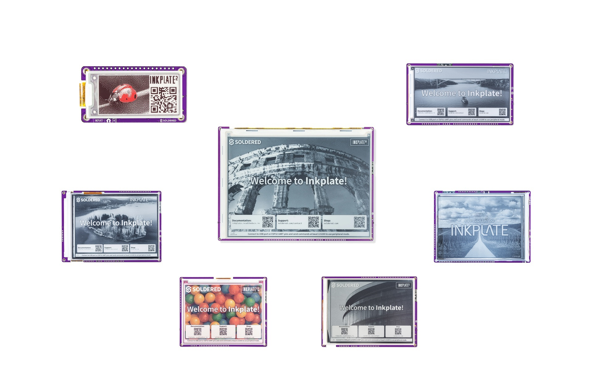

# Soldered Inkplate MicroPython library

[](https://github.com/SolderedElectronics/Inkplate-micropython/actions/workflows/ci.yml)
[](https://github.com/SolderedElectronics/Inkplate-micropython/actions/workflows/ci.yml)
[](https://github.com/SolderedElectronics/Inkplate-micropython/actions/workflows/ci.yml)



The MicroPython modules for the Inkplate product family can be found in this repository. Inkplate is a series of powerful, Wi-Fi and Bluetooth enabled, ESP32-based ePaper display products. Its main feature is simplicity. Just plug in a USB cable, load the MicroPython firmware and the required libraries and run your script on Inkplate itself. The Inkplate product family currently includes Inkplate 10, Inkplate 6, Inkplate 5V2, Inkplate 6FLICK, Inkplate 6PLUS, Inkplate 4TEMPERA, Inkplate 6COLOR, Inkplate 2 and Inkplate 13SPECTRA. 
Inkplate 6 was crowdfunded on [Crowd Supply](https://www.crowdsupply.com/e-radionica/inkplate-6), as well as [Inkplate 10](https://www.crowdsupply.com/e-radionica/inkplate-10), [Inkplate 6PLUS](https://www.crowdsupply.com/e-radionica/inkplate-6plus) and [Inkplate 6COLOR](https://www.crowdsupply.com/soldered/inkplate-6color). Inkplate 2 was funded on [Kickstarter](https://www.kickstarter.com/projects/solderedelectronics/inkplate-2-a-easy-to-use-arduino-compatible-e-paper).

All available to purchase from [Soldered.com](https://soldered.com/categories/inkplate/).

Original effort to enable MicroPython support for Inkplate was done by [tve](https://github.com/tve/micropython-inkplate6). Thank you!

### Setting up Inkplate with MicroPython

In order to get started with running your code on Inkplate, connect the device to your computer via USB and follow these steps:
1. Download the Inkplate-firmware.bin (or Inkplate13SPECTRA-firmware.bin) file onto your computer

2. Flash the aformentioned firmware onto the Inkplate device, this can be done via our [MicroPython VSCode Extention](https://marketplace.visualstudio.com/items?itemName=SolderedElectronics.soldered-micropython-helper) or the [Thonny IDE](https://thonny.org/)

#### Flashing with the VSCode extension
After [setting up the VSCode extension](https://soldered.com/documentation/micropython/getting-started-with-vscode/), go to  `Install MicroPython on your board` and pick `Upload Binary file from PC`, pick the Inkplate-firmware.bin (or Inkplate13SPECTRA-firmware.bin) file and wait for it to flash on the device

#### Flashing via Thonny IDE

In the Thonny IDE, go to `Run -> Configure interpreter` and on the bottom of the window go to `Install or update MicroPython`. On the bottom of that window click on the `≡` button and pick `Select local MicroPython image`, pick the Inkplate-firmware.bin (or Inkplate13SPECTRA-firmware.bin) file on your computer and press `Install`

3. [Install the mpremote package](https://docs.micropython.org/en/latest/reference/mpremote.html)

4. With the mpremote package, we can flash the Inkplate modules onto the device with the following command:
   ```
      mpremote mip install github:SolderedElectronics/Inkplate-micropython/boards/YOUR_DEVICE
   ```
   or if you're running a Windows OS:
   ```
      python -m mpremote mip install github:SolderedElectronics/Inkplate-micropython/boards/YOUR_DEVICE
   ```

   For example, if you want to install drivers for the Inkplate6, it will be the following command:
   ```
      mpremote mip install github:SolderedElectronics/Inkplate-micropython/boards/inkplate6
   ```

   `YOUR_DEVICE` is one of: `inkplate10`, `inkplate6`, `inkplate5v2`, `inkplate6flick`, `inkplate6plusv2`, `inkplate4tempera`, `inkplate6color`, `inkplate2`, `inkplate13spectra`.

   Inkplate6 and Inkplate10 ship in two hardware revisions (classic v1 and V2). The driver
   auto-detects which one is on the I2C bus at `begin()` time; pass `variant=` explicitly
   only to override:
   ```python
   from inkplate6 import Inkplate
   display = Inkplate(Inkplate.INKPLATE_1BIT)  # revision auto-detected
   display = Inkplate(Inkplate.INKPLATE_1BIT, variant="inkplate6v1")  # force classic (non-V2)
   ```


**You only have to do steps 1-4 once when writing MicroPython firmware on your Inkplate!** If you have already done this, proceed from step 5 onwards.

5. Now you can flash examples and write code with the IDE of your choosing!


### Code examples

There are several examples which will indicate all the functions you can use in your own script, under `examples/<your_device>/`:
* `basic_bw.py` / `basic_grayscale.py` / `basic_color.py` / `basic_bwr.py` show you drawing shapes, lines and text on the screen (mono, 8-level grayscale, or color/BWR panels, depending on the board)
* `example_network.py` shows you how to use the network features like doing a GET request and downloading a file
* `battery_and_temperature.py` / `battery_read.py` shows you how to read the internal battery status and the temperature from the internal sensor
* `displayimagesd/display_image_sd.py` shows you how to draw a JPG/BMP/PNG image with or without dithering from an SD card
* `display_image_web.py` shows you how to draw a JPG/BMP/PNG image with or without dithering from a URL
* `gpio_expander.py` shows how to use the GPIO expander on new Inkplate models
* `rtc.py` shows how to use the onboard real-time clock
* `custom_font.py` shows how to load and draw with a custom font
* `touchscreen.py` / `frontlight.py` (Inkplate6FLICK, Inkplate6PLUS, Inkplate4TEMPERA) show touch input and frontlight control
* `sensors/` (Inkplate4TEMPERA) shows the onboard accelerometer, temperature/humidity/gas, buzzer and fuel gauge sensors
* `partial_update.py` (Inkplate13SPECTRA) shows partial-refresh usage on a color panel

More information is provided in the examples themselves in the shape of comments.

### Building the firmware manually

Most users should just flash the prebuilt `firmware/Inkplate-firmware.bin` (classic ESP32 boards) or `firmware/Inkplate13SPECTRA-firmware.bin` (ESP32-S3) as described above. If you need to build it yourself - e.g. to pick up unreleased changes to `firmware/usermods/inkplate/` - this firmware is plain upstream [MicroPython](https://github.com/micropython/micropython) for the `esp32` port, plus this repo's C driver wired in as a `USER_C_MODULES` component. No fork of MicroPython is needed.

1. Clone MicroPython and its submodules, and install ESP-IDF **v5.5.x** (this firmware is developed/tested against v5.5.2) by following MicroPython's own [ESP32 port build instructions](https://github.com/micropython/micropython/tree/master/ports/esp32#requirements):
   ```
   git clone https://github.com/micropython/micropython.git
   cd micropython
   git submodule update --init
   make -C mpy-cross
   ```
2. Install and activate ESP-IDF v5.5.x per [Espressif's setup guide](https://docs.espressif.com/projects/esp-idf/en/v5.5.2/esp32/get-started/index.html), then `source <esp-idf-path>/export.sh` (or your platform equivalent) in the shell you'll build from.
3. Build, pointing `USER_C_MODULES` at this repo's `firmware/usermods/inkplate/`:
   ```
   cd micropython/ports/esp32

   # Classic ESP32 boards (Inkplate6/10/5V2/6FLICK/6PLUS/4TEMPERA/6COLOR/2):
   make BOARD=ESP32_GENERIC BOARD_VARIANT=SPIRAM \
        USER_C_MODULES=/path/to/Inkplate-micropython/firmware/usermods/inkplate

   # Inkplate13SPECTRA (ESP32-S3, octal PSRAM):
   make BOARD=ESP32_GENERIC_S3 BOARD_VARIANT=SPIRAM_OCT \
        USER_C_MODULES=/path/to/Inkplate-micropython/firmware/usermods/inkplate
   ```
   Run `make ... clean` first if you're rebuilding after changing which C files are registered (a stale build directory can leave dangling symbol references).
4. The flashable merged image is generated at `build-<BOARD>-<BOARD_VARIANT>/firmware.bin` (e.g. `build-ESP32_GENERIC-SPIRAM/firmware.bin`) - this is the same file this repo ships as `firmware/Inkplate-firmware.bin`/`firmware/Inkplate13SPECTRA-firmware.bin`. Flash it with the VSCode extension/Thonny steps above, or directly:
   ```
   make BOARD=ESP32_GENERIC BOARD_VARIANT=SPIRAM \
        USER_C_MODULES=/path/to/Inkplate-micropython/firmware/usermods/inkplate \
        PORT=/dev/ttyUSB0 deploy
   ```

The C driver's own host-compilable unit tests (no ESP-IDF/hardware needed) can be run independently with `python3 firmware/usermods/inkplate/tests/run_ci.py test` - the same check CI runs on every push.

### Documentation

Find Inkplate documentation [here](https://soldered.com/documentation/inkplate/). 

### License

This repo is licensed with the MIT License. For more info, see LICENSE.

---

## About Soldered


At Soldered, we design and manufacture a wide selection of electronic products to help you turn your ideas into acts and bring you one step closer to your final project. Our products are intented for makers and crafted in-house by our experienced team in Osijek, Croatia. We believe that sharing is a crucial element for improvement and innovation, and we work hard to stay connected with all our makers regardless of their skill or experience level. Therefore, all our products are open-source. Finally, we always have your back. If you face any problem concerning either your shopping experience or your electronics project, our team will help you deal with it, offering efficient customer service and cost-free technical support anytime. 

## Have fun!

And thank you from your fellow makers at Soldered Electronics.

